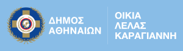
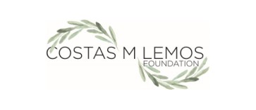
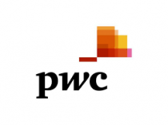

# School of Code: Front-end bootcamp 2019-2020

## Πρόγραμμα ανάπτυξης ψηφιακών δεξιοτήτων

Το εκπαιδευτικό πρόγραμμα εστιάζει στον ρόλο και τις απαραίτητες δεξιότητες και γνώσεις που πρέπει να έχει σήμερα ένας Front-End Developer:

- Responsive web development
- Προχωρημένα θέματα HTML & CSS
- Νέες τεχνικές positioning (Flexbox, CSS Grid)
- Βασικά χαρακτηριστικά της JavaScript και τα κυριότερα frameworks της
- Καλές πρακτικές σχετικά με τη δομή του παραγόμενου κώδικα
- Τεχνικές για βελτιστοποίηση της ταχύτητας και ομαλής λειτουργίας μιας ιστοσελίδας (web performance optimization)

---

ΦΟΡΕΑΣ ΥΛΟΠΟΙΗΣΗΣ:

ΜΕ ΤΗΝ ΥΠΟΣΤΗΡΙΞΗ:

